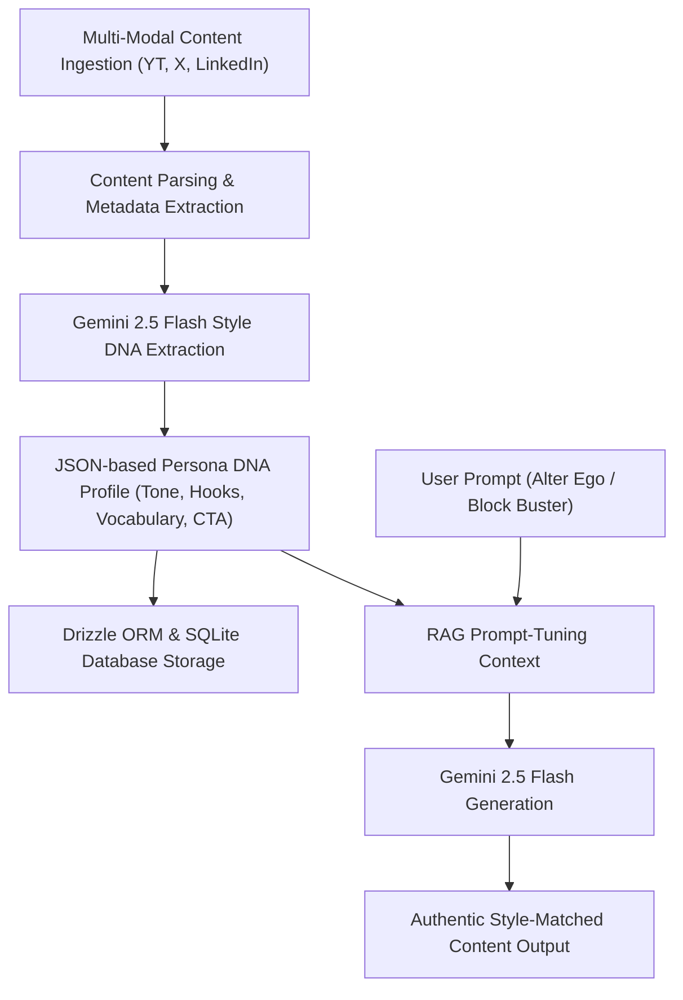
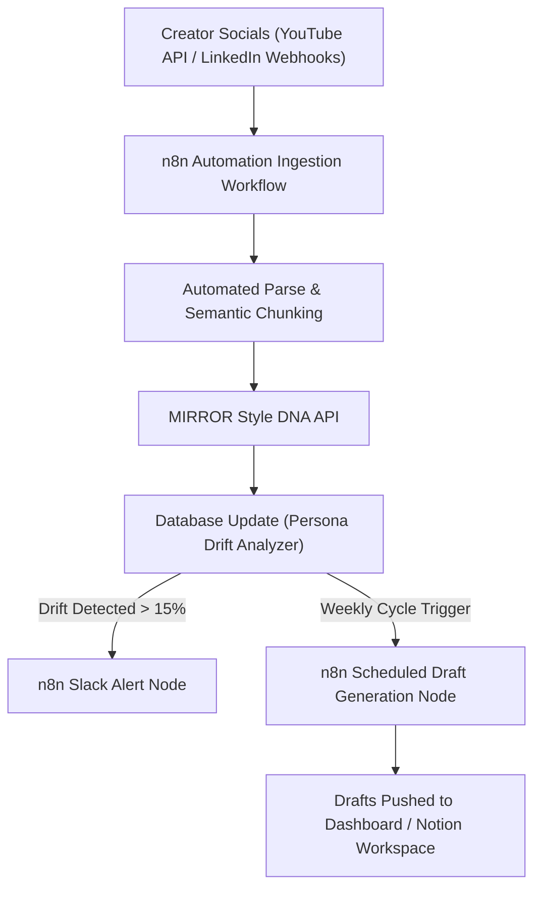

# 🪞 MIRROR — AI Creative Identity Platform

<div align="center">
  
  <p><strong>Cloning your creative voice so you can scale without losing your soul.</strong></p>
  <p><i>Developed by <b>Team Phoenix</b></i></p>
</div>

---

> [!IMPORTANT]
> **MIRROR** is not another generic content generator. It is an **AI-powered Creative Identity Platform** that maps a creator's unique **Style DNA** from their multi-modal content (YouTube, X/Twitter, LinkedIn, Newsletters) and creates a premium digital twin. It generates content that sounds unmistakably like *you*, monitors brand consistency, and tracks your voice evolution.

---

## 💡 Business Idea & Value Proposition

### The Problem
Every creator today faces the same hurdle: **homogenized AI content**. Giving standard LLMs the same prompts yields the same predictable, bland output: the exact same hooks, formatting, emojis, and hashtags. 
When creators use generic AI to scale production, they sacrifice their most valuable asset: **their authentic voice**.

### The Solution: MIRROR
MIRROR analyzes a creator's existing content history to compile a multidimensional **Style DNA** fingerprint. By locking onto their actual linguistic characteristics, MIRROR ensures that all AI-generated content preserves the creator's true cadence, structure, and vocabulary.

### 💰 Business & Monetization Model
MIRROR operates on a tier-based subscription and enterprise licensing model:

| Tier | Price | Target Audience | Features |
| :--- | :--- | :--- | :--- |
| **Free Explorer** | $0 / mo | Novice Creators | Basic Style DNA profiling (1 source channel), limited to 10 Alter Ego generations/mo. |
| **Creator Pro** | $15 / mo | Professional Creators | Unlimited multi-modal source channel sync, real-time Consistency Guardian audits, priority generation, and trend alignment. |
| **Studio & Agency** | $89 / mo | Social Media Agencies | Manage up to 10 custom Style DNA profiles, collaborative drafting workspaces, and API key access for external integrations. |
| **API Marketplace** *(Future)* | Transaction Cut | Brands & Influencers | An exclusive marketplace where verified creators can license their Style DNA profiles to brands for authenticated, automated sponsored content. |

---

## 🛠️ Technology Stack

The MIRROR prototype is engineered with a high-performance, developer-first stack for speed, visual beauty, and seamless LLM context injection:

- **Frontend Framework**: **React + Vite** for a highly responsive, single-page application experience.
- **Routing & Full-Stack Functions**: **TanStack Start & Router** for type-safe routing and server functions that interact directly with database models.
- **Styling & Aesthetics**: **Tailwind CSS** featuring a customized dark obsidian aesthetic, premium glassmorphism variables, and customized layout grids.
- **Animations**: **Framer Motion** to drive micro-animations, loading sequences, transition cards, and interactive sliders.
- **Database**: **SQLite** with **Drizzle ORM** for lightweight, blazing-fast local relational queries and simple schema modifications.
- **Charts & Insights**: **Recharts** to render vector-based radar analysis, growth timelines, and engagement metrics.
- **AI Engine**: **Vercel AI SDK** with **Google Gemini 2.5 Flash** for multi-modal text, image, and video analysis, generating authentic text with minimal latency.

---

## 🧬 Technical Architecture: Style DNA Pipeline

MIRROR's core innovation is the five-stage ingestion-to-generation pipeline that separates standard prompting from context-rich style replication.



1. **Ingestion**: Raw content feeds (YouTube video files/transcripts, markdown text, images, or social links) are fed into the onboarding model.
2. **Analysis**: High-dimensional embeddings and structural audits analyze syntax metrics (sentence length distribution, vocabulary density, slang, hooks, and call-to-actions).
3. **DNA Synthesis**: The profile is synthesized into a standardized, database-stored JSON schema containing:
   - **Tone profile**: Descriptors (e.g. *"Gen-Z hyper-energetic, explanations via pop-culture analogies"*).
   - **Hook patterns**: Exact opening formulas.
   - **CTA styles**: Specific engagement triggers.
   - **Custom keywords**: High-frequency brand terms.
4. **Context Injection**: During generation, the user's prompt is merged with their Style DNA weights inside the system context.
5. **RAG-Style Output**: The Gemini model processes the prompt constrained by the creator's voice, avoiding generic output.

---

## 🚀 Key Modules & Walkthrough

The platform consists of six interactive modules, built to cover the entire creative lifecycle:

### 1. Style DNA Dashboard (`/dashboard`)
Visualizes the creator's fingerprint. Features a customized radar chart mapping vocabulary complexity, tone authority, structural variation, and platform-specific performance markers.

### 2. AI Alter Ego Generator (`/alter-ego`)
A split-pane workspace. Input a prompt (e.g., *"productivity tips"*) and generate content. Toggle the **Compare** view to see the generic AI output side-by-side with MIRROR's style-matched output, demonstrating the immediate value of authentic copy.

### 3. Consistency Guardian (`/consistency`)
A real-time brand safety editor. Paste copy drafts into the guardian to receive an instant consistency score. The tool highlights off-brand wording, tracks stylistic drift, and suggests corrections.

### 4. Block Buster (`/block-buster`)
Crushes writer's block using historical style vectors. It suggests customized viral hooks, outlines, and repurposes old content across different social channels while keeping the core message intact.

### 5. Evolution Tracker (`/evolution`)
Tracks the evolution of the creator's voice. Shows tone trajectory charts, changes in vocabulary over time, and overlays style adjustments with historical post performance.

### 6. Discovery Mode (`/discover`)
A step-by-step onboarding wizard designed for new creators to define their identity:
1. **Select Interests**: Choose primary niches and industries.
2. **Niche Analytics**: Discover tone structures of top creators in those niches.
3. **Source Ingestion**: Paste sample posts or link source channels.
4. **Style Blueprint**: Synthesize a custom Style DNA profile.
5. **Roadmap**: Generate a customized 6-week growth roadmap to jumpstart production.

---

## 🔮 Future Scope & Roadmap: Automation with n8n

The roadmap for MIRROR focuses on scale, automation, and real-time ingestion pipelines:



### 1. n8n Workflow Automation
Integrating **n8n** as our workflow engine will allow us to offer fully automated background loops:
- **Continuous Ingestion**: Set up n8n triggers checking YouTube and LinkedIn APIs. As soon as a creator publishes new content, n8n grabs it, extracts metrics, and updates their Style DNA.
- **Weekly Auto-Drafts**: A cron-style n8n node that reviews the creator's backlog and current trending topics, auto-generates draft content tailored to their Style DNA, and pushes it straight to a Notion dashboard or Slack channel.
- **Automated Drift Webhooks**: When the n8n scheduler runs checks on recent content performance, it can send Slack notifications or email reports detailing any negative shifts in consistency.

### 2. Database Migration & Vector Search
- **Migration to PostgreSQL**: Transition the metadata layer from SQLite to PostgreSQL.
- **pgvector & Semantic Search**: Implement vector searching directly on database tables to instantly retrieve topically and stylistically relevant paragraphs from the creator's past history.
- **ChromaDB / Pinecone Integration**: For agency clients managing high volumes of video transcript data, integrate dedicated vector databases to manage semantic lookup speeds under 100ms.

---

## 💻 Local Development

Follow these steps to spin up the prototype locally on your machine:

### Prerequisites
- [Node.js](https://nodejs.org/) (v18+ recommended)
- A Google Gemini API Key (optional — falls back to simulated responses if missing)

### Installation Guide

1. **Clone and enter the project folder**:
   ```bash
   cd MIRROR
   ```

2. **Install dependencies**:
   ```bash
   npm install
   ```

3. **Configure environment variables**:
   Create a `.env` file in the root directory:
   ```env
   GOOGLE_GENERATIVE_AI_API_KEY="your-gemini-api-key-here"
   ```
   *(If left empty, MIRROR runs in a zero-setup simulation mode utilizing the mock data engine for instant demonstration).*

4. **Launch the development server**:
   ```bash
   npm run dev
   ```

5. **Open in browser**:
   Navigate to `http://localhost:5173`. Click **Log In** to immediately access the dashboard loaded with a default creator persona and sample content history.

---
Developed by **Team Phoenix** — 2026.
